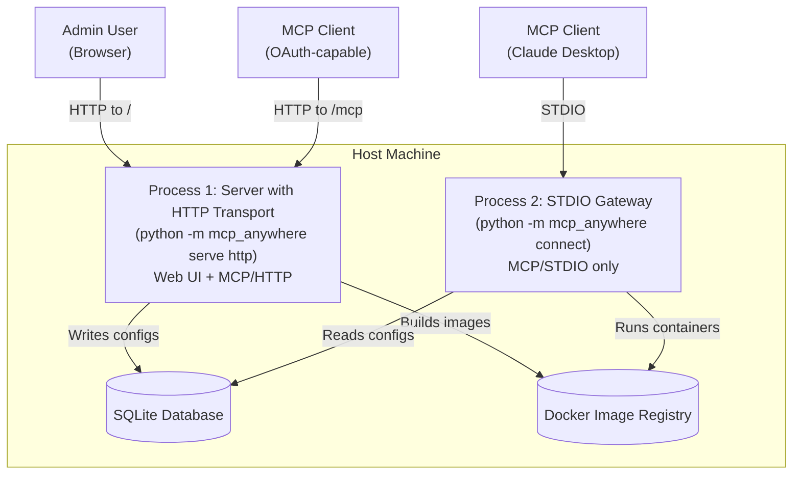

# Engineering Plan: MCP Anywhere Transport & OAuth Architecture Refactoring

## Executive Summary

This document provides the complete engineering plan to fix two critical architectural issues in MCP Anywhere:

1. **STDIO Transport Contamination**: Current stdio mode launches the entire application stack, making it unusable for MCP clients
2. **Missing OAuth Infrastructure**: HTTP transport lacks required OAuth metadata endpoints for MCP client discovery

## Architecture Overview

### Transport Modes Clarification

**MCP Transport** refers to how MCP clients (like Claude Desktop, IDEs) connect to get MCP protocol responses:
- **HTTP Transport**: MCP protocol served over HTTP at `/mcp` endpoint (with OAuth)
- **STDIO Transport**: MCP protocol served over standard input/output streams

### Two-Process Decoupled Architecture

The solution separates concerns into two independent processes that share only a database and Docker image registry:



**Process 1: Management Server with HTTP Transport** (`python -m mcp_anywhere serve http`)
- Long-running process started once by the administrator
- Provides web UI for server management at `/`
- Provides MCP protocol over HTTP at `/mcp` (with OAuth authentication)
- Builds Docker container images
- Handles OAuth authorization
- Writes server configurations to database

**Process 2: STDIO Gateway** (`python -m mcp_anywhere connect`)
- Ephemeral process started by MCP clients
- Provides MCP protocol over STDIO (no HTTP server at all)
- Reads server configs from database (read-only)
- Proxies stdio to Docker containers
- No web server, no authentication, minimal logging
- Terminates when client disconnects

### Command Usage Examples

```bash
# Start the management server with HTTP transport for MCP
# This provides BOTH the web UI AND the MCP protocol over HTTP
python -m mcp_anywhere serve http --port 8000
# Access web UI at: http://localhost:8000/
# MCP clients connect to: http://localhost:8000/mcp (with OAuth)

# For MCP clients that need STDIO transport (like Claude Desktop)
# They run this command directly (no server needed to be running first)
python -m mcp_anywhere connect
# This reads the database and provides MCP over stdio
```

## Phase 1: Lightweight STDIO Gateway Implementation

### 1.1 New File: `src/mcp_anywhere/transport/stdio_gateway.py`

```python
"""
Lightweight STDIO gateway for MCP client connections.
This module provides a clean stdio interface without any web server or management overhead.
"""

import asyncio
import sys
import os
from typing import List
from fastmcp import FastMCP
from sqlalchemy.ext.asyncio import create_async_engine, AsyncSession
from sqlalchemy.orm import sessionmaker
from sqlalchemy import select

from mcp_anywhere.database import MCPServer
from mcp_anywhere.core.mcp_manager import create_mcp_config
from mcp_anywhere.config import Config
from mcp_anywhere.logging_config import get_logger

# Configure minimal logging for stdio mode
logger = get_logger(__name__)
logger.setLevel("ERROR")  # Only log errors to stderr

async def run_connect_gateway() -> None:
    """
    Run the lightweight STDIO gateway for MCP client connections.
    
    This function:
    1. Reads server configurations from the database (read-only)
    2. Creates FastMCP proxy instances for each configured server
    3. Runs the stdio transport for client communication
    4. Does NOT start any web servers or management interfaces
    """
    try:
        # Silence all non-critical logs to keep stdio clean
        import logging
        logging.getLogger("sqlalchemy").setLevel(logging.ERROR)
        logging.getLogger("docker").setLevel(logging.ERROR)
        logging.getLogger("uvicorn").setLevel(logging.ERROR)
        logging.getLogger("starlette").setLevel(logging.ERROR)
        
        # 1. Connect to database (read-only)
        engine = create_async_engine(
            Config.SQLALCHEMY_DATABASE_URI,
            echo=False,  # No SQL logs
            pool_size=1,  # Minimal connection pool
            max_overflow=0
        )
        
        AsyncSessionLocal = sessionmaker(
            engine, 
            class_=AsyncSession, 
            expire_on_commit=False
        )
        
        servers: List[MCPServer] = []
        async with AsyncSessionLocal() as session:
            # Read all configured servers
            result = await session.execute(
                select(MCPServer).where(MCPServer.is_active == True)
            )
            servers = result.scalars().all()
            
            # Eagerly load relationships to avoid lazy loading issues
            for server in servers:
                _ = server.env_variables  # Force load
        
        await engine.dispose()  # Close DB connection
        
        if not servers:
            # Return empty capabilities if no servers configured
            router = FastMCP(
                name="MCP Anywhere Gateway",
                instructions="No servers configured. Please use the web UI to add servers."
            )
            await router.run(transport="stdio")
            return
        
        # 2. Create the FastMCP router
        router = FastMCP(
            name="MCP Anywhere Gateway",
            instructions="Unified gateway for Model Context Protocol servers"
        )
        
        # 3. Generate proxy configuration from database
        proxy_config = create_mcp_config(servers)
        
        if not proxy_config.get("mcpServers"):
            logger.error("Failed to generate proxy configurations")
            return
        
        # 4. Mount each server as a proxy with its unique prefix
        for server in servers:
            server_id = server.id  # 8-character unique ID
            
            # Create individual proxy config for this server
            single_config = create_mcp_config([server])
            
            if not single_config.get("mcpServers"):
                continue
                
            # Create proxy instance
            proxy = FastMCP.as_proxy(single_config)
            
            # Mount with server ID as prefix
            router.mount(proxy, prefix=server_id)
            
            # Log only to stderr if debug mode
            if Config.DEBUG:
                logger.debug(f"Mounted '{server.name}' at prefix '{server_id}'")
        
        # 5. Run the stdio transport
        await router.run(transport="stdio")
        
    except KeyboardInterrupt:
        # Clean shutdown on Ctrl+C
        pass
    except Exception as e:
        # Log errors to stderr only
        logger.error(f"Gateway error: {e}", exc_info=Config.DEBUG)
        sys.exit(1)
```

### 1.2 Updated CLI: `src/mcp_anywhere/__main__.py`

```python
# Modify the create_parser function to add the connect command

def create_parser() -> argparse.ArgumentParser:
    """Create and configure the argument parser."""
    parser = argparse.ArgumentParser(
        description="MCP Anywhere - Unified gateway for Model Context Protocol servers",
        prog="mcp-anywhere"
    )
    
    subparsers = parser.add_subparsers(
        dest="command",
        help="Available commands",
        required=True
    )
    
    # Serve command - starts management server with MCP transport options
    serve_parser = subparsers.add_parser(
        "serve",
        help="Start the MCP Anywhere server (management UI + MCP transport)"
    )
    
    serve_subparsers = serve_parser.add_subparsers(
        dest="transport",
        help="MCP transport mode for client connections",
        required=True
    )
    
    # HTTP transport - Management UI + MCP over HTTP
    http_parser = serve_subparsers.add_parser(
        "http",
        help="Run with HTTP transport (Web UI at /, MCP endpoint at /mcp)"
    )
    http_parser.add_argument("--host", type=str, default="0.0.0.0")
    http_parser.add_argument("--port", type=int, default=8000)
    
    # Connect command - for MCP clients
    connect_parser = subparsers.add_parser(
        "connect",
        help="Connect as MCP client via STDIO (lightweight mode)"
    )
    # No arguments needed - runs in stdio mode only
    
    # Reset command remains unchanged
    reset_parser = subparsers.add_parser(
        "reset",
        help="Reset MCP Anywhere data"
    )
    reset_parser.add_argument("--confirm", action="store_true")
    
    return parser

# Update main() function
async def main() -> None:
    """Main entry point."""
    try:
        parser = create_parser()
        args = parser.parse_args()
        
        if args.command == "serve":
            if args.transport == "http":
                logger.info(f"Starting MCP Anywhere Server with HTTP transport")
                logger.info(f"Web UI: http://{args.host}:{args.port}/")
                logger.info(f"MCP Endpoint: http://{args.host}:{args.port}/mcp")
                await run_http_server(host=args.host, port=args.port)
                
        elif args.command == "connect":
            # Import here to avoid loading unnecessary modules
            from mcp_anywhere.transport.stdio_gateway import run_connect_gateway
            await run_connect_gateway()
            
        elif args.command == "reset":
            reset_data(confirm=args.confirm)
            
    except KeyboardInterrupt:
        pass
    except Exception as e:
        if args.command != "connect":  # Don't pollute stdio
            logger.error(f"Failed to start: {e}")
        sys.exit(1)
```

## Phase 2: OAuth Implementation Using MCP SDK

### 2.1 Required Dependencies

```toml
# pyproject.toml additions
[dependencies]
mcp = ">=1.1.2"  # Already present, ensure version supports auth module
pydantic = ">=2.0.0"
pydantic-settings = ">=2.0.0"
httpx = ">=0.27.0"  # For token introspection
python-jose = ">=3.3.0"  # For JWT handling
```

### 2.2 OAuth Provider Implementation

#### File: `src/mcp_anywhere/auth/mcp_provider.py`

```python
"""
MCP SDK-based OAuth provider implementation.
Uses the MCP auth module for spec-compliant OAuth 2.0 flows.
"""

import secrets
import time
from datetime import datetime, timedelta
from typing import Optional, Dict, Any
from starlette.requests import Request
from sqlalchemy import select
from sqlalchemy.ext.asyncio import AsyncSession

from mcp.server.auth.provider import (
    OAuthAuthorizationServerProvider,
    AccessToken,
    RegistrationError,
    RegistrationErrorCode,
    TokenError,
    TokenErrorCode
)

from mcp_anywhere.auth.models import User, OAuth2Client, AuthorizationCode
from mcp_anywhere.config import Config
from mcp_anywhere.logging_config import get_logger

logger = get_logger(__name__)


class MCPAnywhereAuthProvider(OAuthAuthorizationServerProvider):
    """
    OAuth 2.0 provider that integrates MCP SDK auth with our database.
    """
    
    def __init__(self, db_session_factory):
        """Initialize with a database session factory."""
        self.db_session_factory = db_session_factory
        self.auth_codes = {}  # In-memory storage for demo, use DB in production
        self.access_tokens = {}  # Token storage
        
    async def handle_authorization_request(
        self,
        request: Request,
        client_id: str,
        redirect_uri: str,
        state: Optional[str],
        scope: str,
        response_type: str
    ) -> tuple[bool, Optional[str]]:
        """
        Validate authorization request and check user authentication.
        Returns (is_valid, error_message).
        """
        async with self.db_session_factory() as session:
            # Validate client
            stmt = select(OAuth2Client).where(OAuth2Client.client_id == client_id)
            client = await session.scalar(stmt)
            
            if not client:
                return False, "invalid_client"
            
            if client.redirect_uri != redirect_uri:
                return False, "invalid_redirect_uri"
            
            # Check if user is authenticated (via session)
            user_id = request.session.get("user_id")
            if not user_id:
                return False, "login_required"
            
            # Store request details for later
            request.session["oauth_request"] = {
                "client_id": client_id,
                "redirect_uri": redirect_uri,
                "scope": scope,
                "state": state,
                "user_id": user_id
            }
            
            return True, None
    
    async def create_authorization_code(
        self,
        request: Request,
        client_id: str,
        redirect_uri: str,
        scope: str,
        user_id: str
    ) -> str:
        """Generate and store an authorization code."""
        code = secrets.token_urlsafe(32)
        expires_at = time.time() + 600  # 10 minutes
        
        self.auth_codes[code] = {
            "client_id": client_id,
            "redirect_uri": redirect_uri,
            "scope": scope,
            "user_id": user_id,
            "expires_at": expires_at
        }
        
        return code
    
    async def exchange_authorization_code(
        self,
        code: str,
        client_id: str,
        client_secret: str,
        redirect_uri: str
    ) -> Optional[AccessToken]:
        """Exchange authorization code for access token."""
        # Validate client credentials
        async with self.db_session_factory() as session:
            stmt = select(OAuth2Client).where(OAuth2Client.client_id == client_id)
            client = await session.scalar(stmt)
            
            if not client or client.client_secret != client_secret:
                raise TokenError(TokenErrorCode.INVALID_CLIENT)
        
        # Validate authorization code
        auth_code_data = self.auth_codes.get(code)
        if not auth_code_data:
            raise TokenError(TokenErrorCode.INVALID_GRANT)
        
        # Check expiration
        if time.time() > auth_code_data["expires_at"]:
            del self.auth_codes[code]
            raise TokenError(TokenErrorCode.INVALID_GRANT)
        
        # Validate code parameters
        if (auth_code_data["client_id"] != client_id or
            auth_code_data["redirect_uri"] != redirect_uri):
            raise TokenError(TokenErrorCode.INVALID_GRANT)
        
        # Generate access token
        token = secrets.token_urlsafe(32)
        expires_at = int(time.time() + 3600)  # 1 hour
        
        access_token = AccessToken(
            token=token,
            client_id=client_id,
            scopes=auth_code_data["scope"].split(),
            expires_at=expires_at,
            resource=f"{Config.SERVER_URL}/mcp"
        )
        
        # Store token for introspection
        self.access_tokens[token] = access_token
        
        # Delete used authorization code
        del self.auth_codes[code]
        
        return access_token
    
    async def introspect_token(self, token: str) -> Optional[AccessToken]:
        """
        Introspect an access token for resource server validation.
        Required for the introspection endpoint.
        """
        access_token = self.access_tokens.get(token)
        
        if not access_token:
            return None
        
        # Check expiration
        if time.time() > access_token.expires_at:
            del self.access_tokens[token]
            return None
        
        return access_token
    
    async def revoke_token(self, token: str, token_type_hint: Optional[str] = None) -> bool:
        """Revoke an access token."""
        if token in self.access_tokens:
            del self.access_tokens[token]
            return True
        return False
    
    async def register_client(
        self,
        client_name: str,
        redirect_uris: list[str],
        grant_types: list[str],
        response_types: list[str],
        scope: str
    ) -> Dict[str, Any]:
        """
        Register a new OAuth client (optional, can be disabled).
        """
        client_id = secrets.token_urlsafe(16)
        client_secret = secrets.token_urlsafe(32)
        
        async with self.db_session_factory() as session:
            client = OAuth2Client(
                client_id=client_id,
                client_secret=client_secret,
                client_name=client_name,
                redirect_uri=redirect_uris[0] if redirect_uris else "",
                scope=scope
            )
            session.add(client)
            await session.commit()
        
        return {
            "client_id": client_id,
            "client_secret": client_secret,
            "client_name": client_name,
            "redirect_uris": redirect_uris,
            "grant_types": grant_types,
            "response_types": response_types,
            "scope": scope
        }
```

### 2.3 OAuth Routes Using MCP SDK

#### File: `src/mcp_anywhere/auth/mcp_routes.py`

```python
"""
OAuth routes using MCP SDK's auth module.
Provides all required endpoints including .well-known discovery.
"""

from typing import List
from starlette.routing import Route, Mount
from starlette.requests import Request
from starlette.responses import HTMLResponse, RedirectResponse, JSONResponse
from starlette.templating import Jinja2Templates

from mcp.server.auth.routes import create_auth_routes, cors_middleware
from mcp.server.auth.settings import AuthSettings, ClientRegistrationOptions
from mcp.server.auth.handlers.metadata import MetadataHandler
from mcp.server.auth.handlers.authorize import AuthorizationHandler
from mcp.server.auth.handlers.register import RegistrationHandler
from mcp.server.auth.handlers.revoke import RevocationHandler

from mcp_anywhere.auth.mcp_provider import MCPAnywhereAuthProvider
from mcp_anywhere.config import Config
from mcp_anywhere.logging_config import get_logger

logger = get_logger(__name__)

# Templates for login/consent pages
templates = Jinja2Templates(directory="src/mcp_anywhere/web/templates")


async def login_page(request: Request) -> HTMLResponse:
    """Render the login page."""
    error = request.query_params.get("error")
    return templates.TemplateResponse(
        request,
        "auth/login.html",
        {"error": error}
    )


async def handle_login(request: Request) -> RedirectResponse:
    """Process login form submission."""
    form = await request.form()
    username = form.get("username")
    password = form.get("password")
    
    # Get database session
    async with request.app.state.get_async_session() as session:
        from sqlalchemy import select
        from mcp_anywhere.auth.models import User
        
        stmt = select(User).where(User.username == username)
        user = await session.scalar(stmt)
        
        if user and user.check_password(password):
            # Set session
            request.session["user_id"] = user.id
            request.session["username"] = user.username
            
            # Redirect to original OAuth request or home
            next_url = request.query_params.get("next", "/")
            return RedirectResponse(url=next_url, status_code=302)
    
    # Login failed
    return RedirectResponse(
        url="/auth/login?error=invalid_credentials",
        status_code=302
    )


async def consent_page(request: Request) -> HTMLResponse:
    """Render the consent page."""
    oauth_request = request.session.get("oauth_request", {})
    
    if not oauth_request:
        return RedirectResponse(url="/", status_code=302)
    
    return templates.TemplateResponse(
        request,
        "auth/consent.html",
        {
            "client_id": oauth_request.get("client_id"),
            "scope": oauth_request.get("scope"),
            "username": request.session.get("username")
        }
    )


async def handle_consent(request: Request) -> RedirectResponse:
    """Process consent form submission."""
    form = await request.form()
    action = form.get("action")
    
    oauth_request = request.session.get("oauth_request", {})
    if not oauth_request:
        return RedirectResponse(url="/", status_code=302)
    
    provider = request.app.state.oauth_provider
    
    if action == "allow":
        # Generate authorization code
        code = await provider.create_authorization_code(
            request=request,
            **oauth_request
        )
        
        # Build redirect URL
        redirect_uri = oauth_request["redirect_uri"]
        params = f"code={code}"
        if oauth_request.get("state"):
            params += f"&state={oauth_request['state']}"
        
        redirect_url = f"{redirect_uri}?{params}"
    else:
        # User denied
        redirect_uri = oauth_request["redirect_uri"]
        params = "error=access_denied"
        if oauth_request.get("state"):
            params += f"&state={oauth_request['state']}"
        
        redirect_url = f"{redirect_uri}?{params}"
    
    # Clear OAuth request from session
    del request.session["oauth_request"]
    
    return RedirectResponse(url=redirect_url, status_code=302)


def create_oauth_routes(get_async_session) -> List[Route]:
    """
    Create all OAuth routes using MCP SDK.
    
    This includes:
    - /.well-known/oauth-authorization-server
    - /.well-known/oauth-protected-resource
    - /auth/authorize
    - /auth/token
    - /auth/introspect
    - /auth/revoke
    - /auth/register (optional)
    """
    
    # Create provider instance
    provider = MCPAnywhereAuthProvider(get_async_session)
    
    # Configure auth settings
    auth_settings = AuthSettings(
        issuer_url=str(Config.SERVER_URL),
        client_registration_options=ClientRegistrationOptions(
            enabled=False,  # Disable dynamic registration for security
            valid_scopes=["mcp:read", "mcp:write"],
            default_scopes=["mcp:read"]
        ),
        resource_server_url=f"{Config.SERVER_URL}/mcp",
        service_documentation_url=f"{Config.SERVER_URL}/docs"
    )
    
    # Create MCP SDK auth routes (includes .well-known endpoints)
    mcp_routes = create_auth_routes(
        provider=provider,
        issuer_url=auth_settings.issuer_url,
        service_documentation_url=auth_settings.service_documentation_url,
        client_registration_options=auth_settings.client_registration_options,
        revocation_options=auth_settings.revocation_options
    )
    
    # Add our custom login/consent UI routes
    custom_routes = [
        Route("/auth/login", endpoint=login_page, methods=["GET"]),
        Route("/auth/login", endpoint=handle_login, methods=["POST"]),
        Route("/auth/consent", endpoint=consent_page, methods=["GET"]),
        Route("/auth/consent", endpoint=handle_consent, methods=["POST"]),
    ]
    
    # Add introspection endpoint for resource servers
    async def introspect_endpoint(request: Request) -> JSONResponse:
        """Token introspection endpoint (RFC 7662)."""
        form = await request.form()
        token = form.get("token")
        
        if not token:
            return JSONResponse({"active": False})
        
        access_token = await provider.introspect_token(token)
        
        if not access_token:
            return JSONResponse({"active": False})
        
        return JSONResponse({
            "active": True,
            "client_id": access_token.client_id,
            "scope": " ".join(access_token.scopes),
            "exp": access_token.expires_at,
            "iat": int(time.time()),
            "token_type": "Bearer",
            "aud": access_token.resource
        })
    
    custom_routes.append(
        Route(
            "/auth/introspect",
            endpoint=cors_middleware(introspect_endpoint, ["POST", "OPTIONS"]),
            methods=["POST", "OPTIONS"]
        )
    )
    
    return mcp_routes + custom_routes
```

### 2.4 Updated Web Application

#### File: `src/mcp_anywhere/web/app.py` (Modified)

```python
# Add to imports
from mcp_anywhere.auth.mcp_routes import create_oauth_routes
from mcp_anywhere.auth.mcp_provider import MCPAnywhereAuthProvider

# In create_app function, replace auth routes section:

def create_app(transport_mode: str = "http") -> Starlette:
    """Create the Starlette application."""
    
    @asynccontextmanager
    async def lifespan(app: Starlette):
        """Application lifespan manager."""
        # ... existing startup code ...
        
        # Initialize OAuth provider if in HTTP mode
        if transport_mode == "http":
            app.state.oauth_provider = MCPAnywhereAuthProvider(
                app.state.get_async_session
            )
        
        yield
        
        # ... existing shutdown code ...
    
    # Create routes
    routes = [
        Mount("/static", app=StaticFiles(directory="..."), name="static"),
        Mount("/", routes=web_routes, name="web"),
    ]
    
    # Add OAuth routes for HTTP mode
    if transport_mode == "http":
        oauth_routes = create_oauth_routes(app.state.get_async_session)
        routes.extend(oauth_routes)
        
        # Mount MCP endpoint with OAuth protection
        from mcp.server.auth.middleware.bearer_auth import BearerAuthMiddleware
        
        mcp_app = app.state.mcp_manager.router.get_asgi_app()
        protected_mcp = BearerAuthMiddleware(
            mcp_app,
            token_verifier=app.state.oauth_provider.introspect_token
        )
        
        routes.append(
            Mount("/mcp", app=protected_mcp, name="mcp")
        )
    
    # Create Starlette app
    app = Starlette(
        debug=Config.DEBUG,
        lifespan=lifespan,
        routes=routes,
        middleware=[
            Middleware(SessionMiddleware, secret_key=Config.SECRET_KEY),
            # ... other middleware ...
        ]
    )
    
    return app
```

## Implementation Notes

### Database Considerations

1. **Shared Database Access**: Both processes access the same SQLite database. The management server writes, the gateway only reads.

2. **Connection Management**: The gateway uses a minimal connection pool (size=1) since it's single-user.

3. **Eager Loading**: The gateway eagerly loads all relationships to avoid lazy loading issues after closing the database connection.

### Docker Container Management

1. **Image Building**: Only the management server builds Docker images using the ContainerManager.

2. **Container Execution**: The gateway runs containers directly via `docker run` commands through FastMCP's proxy mechanism.

3. **Resource Limits**: Containers are limited to 512MB RAM and 0.5 CPU to prevent resource exhaustion.

### Security Considerations

1. **OAuth Token Storage**: In production, replace in-memory token storage with database-backed storage or Redis.

2. **JWT vs Opaque Tokens**: Current implementation uses opaque tokens with introspection. Consider JWTs for better performance.

3. **CORS Configuration**: The MCP SDK's `cors_middleware` handles CORS for OAuth endpoints automatically.

### Error Handling

1. **Gateway Errors**: All errors in the gateway are logged to stderr only, keeping stdio clean for MCP protocol.

2. **OAuth Errors**: The MCP SDK handles OAuth error responses according to RFC 6749.

3. **Container Failures**: FastMCP handles container startup failures and reports them through the MCP protocol.

## Testing Strategy

### Manual Testing

1. **Management Server**:
   ```bash
   python -m mcp_anywhere serve http
   # Open http://localhost:8000
   # Add servers via web UI
   ```

2. **STDIO Gateway**:
   ```bash
   # Test directly
   python -m mcp_anywhere connect
   
   # Test with MCP client
   echo '{"jsonrpc":"2.0","method":"initialize","params":{},"id":1}' | python -m mcp_anywhere connect
   ```

3. **OAuth Flow**:
   ```bash
   # Get authorization code
   curl "http://localhost:8000/auth/authorize?client_id=test&redirect_uri=http://localhost:3000/callback&response_type=code&scope=mcp:read"
   
   # Exchange for token
   curl -X POST "http://localhost:8000/auth/token" \
     -d "grant_type=authorization_code&code=...&client_id=test&client_secret=..."
   
   # Use token
   curl -H "Authorization: Bearer ..." "http://localhost:8000/mcp"
   ```

### Automated Tests

```python
# tests/test_stdio_gateway.py
import asyncio
import json

async def test_gateway_clean_stdio():
    """Ensure gateway produces only MCP protocol output."""
    proc = await asyncio.create_subprocess_exec(
        "python", "-m", "mcp_anywhere", "connect",
        stdin=asyncio.subprocess.PIPE,
        stdout=asyncio.subprocess.PIPE,
        stderr=asyncio.subprocess.PIPE
    )
    
    # Send initialize request
    request = json.dumps({
        "jsonrpc": "2.0",
        "method": "initialize",
        "params": {"protocolVersion": "1.0"},
        "id": 1
    })
    
    stdout, stderr = await proc.communicate(request.encode())
    
    # Stdout should be valid JSON-RPC
    response = json.loads(stdout)
    assert response["jsonrpc"] == "2.0"
    
    # Stderr should be empty or minimal
    assert len(stderr) < 100  # Allow for minimal error output

# tests/test_oauth_discovery.py
async def test_wellknown_endpoints(client):
    """Test OAuth discovery endpoints."""
    
    # Authorization server metadata
    response = await client.get("/.well-known/oauth-authorization-server")
    assert response.status_code == 200
    metadata = response.json()
    assert "issuer" in metadata
    assert "authorization_endpoint" in metadata
    assert "token_endpoint" in metadata
    assert "introspection_endpoint" in metadata
    
    # Protected resource metadata
    response = await client.get("/.well-known/oauth-protected-resource")
    assert response.status_code == 200
    metadata = response.json()
    assert "resource" in metadata
    assert "oauth_authorization_server" in metadata
```

## Deployment Configuration

### Environment Variables

```bash
# .env file

# Database
DATABASE_URL=sqlite+aiosqlite:///./data/mcp_anywhere.db

# OAuth
SERVER_URL=http://localhost:8000
JWT_SECRET_KEY=your-secret-key-here
OAUTH_TOKEN_EXPIRES=3600

# Logging
LOG_LEVEL=INFO  # For management server
DEBUG=false

# Docker
DOCKER_TIMEOUT=30
CONTAINER_MEMORY_LIMIT=512m
CONTAINER_CPU_LIMIT=0.5
```

### Client Configuration Example

For Claude Desktop or other MCP clients:

```json
{
  "mcp-anywhere": {
    "command": "python",
    "args": ["-m", "mcp_anywhere", "connect"],
    "env": {}
  }
}
```

## Migration From Current Implementation

1. **Remove Old Files**:
   - `src/mcp_anywhere/transport/stdio_server.py` (replaced by stdio_gateway.py)
   - `src/mcp_anywhere/auth/oauth_server.py` (replaced by mcp_provider.py)
   - `src/mcp_anywhere/auth/routes.py` (replaced by mcp_routes.py)

2. **Update Dependencies**:
   ```bash
   pip install "mcp[auth]>=1.1.2"
   ```

3. **Database Migration**: No changes needed, existing tables work as-is.

4. **Docker Images**: Rebuild any existing images to ensure compatibility.

## Conclusion

This architecture provides:

1. **Clean STDIO Interface**: The gateway produces only MCP protocol messages, making it compatible with all MCP clients.

2. **Complete OAuth Support**: Using MCP SDK's auth module ensures spec compliance and provides all required discovery endpoints.

3. **Decoupled Processes**: Management and gateway concerns are completely separated, improving maintainability and reliability.

4. **Fast Client Connections**: The lightweight gateway starts in milliseconds, not seconds.

5. **Production Ready**: The solution uses battle-tested components from the MCP SDK rather than custom implementations.
